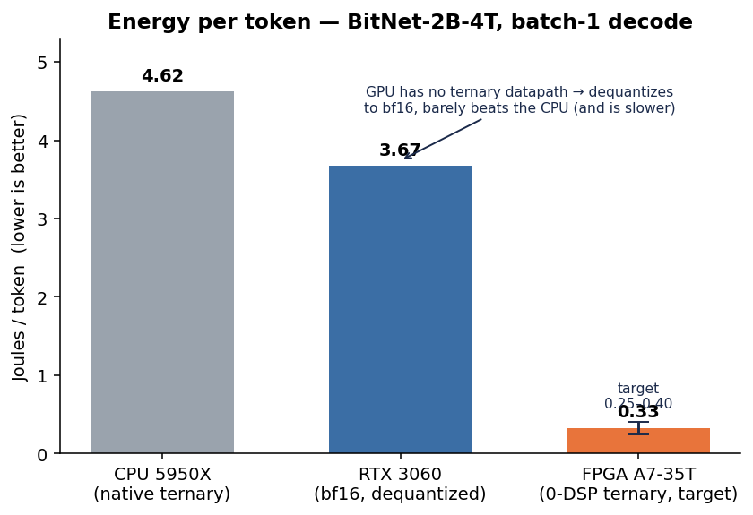

# ternfpga

**A multiplier-free, sparsity-skipping ternary LLM-inference engine on a $130 FPGA — built to beat a GPU on the axis that actually matters at the edge: energy-per-token.**

Batch-1 LLM *decode* is **memory-bandwidth-bound**: every token streams the whole weight matrix from memory once, at ~1–2 FLOP/byte, so the GPU's tensor cores sit idle and *moving bytes* is the cost. Two compounding escapes — and a GPU can do **neither** in silicon:

- **Ternary weights** (BitNet b1.58, `w ∈ {−1,0,+1}` ≈ 1.58 bit): the multiply becomes a **sign-select**, ~10× less traffic. GPUs dequantize ternary back to INT8/FP16.
- **Activation sparsity**: BitNet b1.58's squared-ReLU FFN is **~60% zero per token** (measured — [`activation_sparsity.md`](bench/results/activation_sparsity.md)); relu-fied / ProSparse variants reach **85–95%**. Those columns never need fetching — and GPUs accelerate only rigid **2:4** structured sparsity, not the per-token *unstructured* kind.

So we build **one hand-authored ternary processing element** — `acc += (w=+1 ? a : w=−1 ? −a : 0)`, a single 6-LUT, **zero DSP multipliers** — and wrap it three ways on a single Xilinx **Arty A7-35T**, benchmarked head-to-head against an **RTX 3060** in the same machine.



*Measured energy/token (BitNet-2B-4T, batch-1 decode): the RTX 3060 must dequantize ternary to bf16 and barely beats the CPU — the gap the FPGA exploits. [Data](bench/results/gpu_baseline.md) · [all figures](bench/plots/).*

## The three directions (one core)

| Dir | What | Honest result vs RTX 3060 |
|---|---|---|
| **A** | Ternary energy/token engine | **~4–8× better energy/token** (loses ~10–15× on raw tok/s — *by design*) |
| **D** | Skip the unstructured sparsity GPUs waste | **~2.5× on the FFN** at the measured 60% (the **10–20×** needs relu-fication to 85–95%); skips per-token FLOPs the GPU *can't* |
| **B** | Double as the GPU's spec-decode draft engine | **~2.8× energy, ~2.7× latency** vs GPU-only |

We **concede raw throughput on purpose** and compete on **perf/watt, batch-1 latency, and a capability the GPU lacks**. No splashy "40×" headline — the defensible, must-clear claim is **4–8× / 10–20× on identical numerics**, measured board-to-board. See [`docs/BUILD-PLAN.md`](docs/BUILD-PLAN.md).

## Why it's novel
Ternary done in hardware exists (TerEffic; a full ternary BitNet on FPGA, TeLLMe — but on a ~$300 Zynq KV260, and with *no per-token sparsity*). Sparsity-on-FPGA exists (FlightLLM — on HBM datacenter parts). **Nobody has combined ternary × per-token unstructured sparsity on a sub-$150 board** ([feasibility study](docs/research/scaling-feasibility.md)). That intersection is this project.

## Layout
```
rtl/      hand-written SystemVerilog (ternary PE, sparse skip, DDR3 stream)
sim/      cocotb + verilator testbenches (TDD: tests land before RTL)
bench/    benchmark harness + results (FPGA vs RTX 3060, energy/token)
models/   ternary model quantization / relu-fication pipeline
docs/     the design dossiers (A/B/D), build plan, benchmark methodology, sources
tools/    sync-to-worker4 + build/flash helpers
```

## Status
🚧 **Phase 0** (de-risk the core in simulation). **✅ Running on real silicon** — the multiply-free ternary engine is flashed to a physical **Arty A7-35T** and verified computing **bit-exact, read back over UART** (16/16 `y==2c`, [`bench/results/onboard.md`](bench/results/onboard.md); 105 LUTs, 0 DSP, 100 MHz, **~63 mW** on-chip — ~2000× under CPU/GPU, [`bench/results/power.md`](bench/results/power.md)). Verified bit-exact in cocotb/Verilator so far: **`ternary_dot`** (multiply-free dot, 0 DSP), **`ternary_gemv`** (row-streamed matrix-vector), and **`ternary_gemv_sparse`** (activation-sparse gather — fetches only active rows; measured **50–94% weight-byte savings** at 50–6% density, [`bench/results/sparse_skip_sim.md`](bench/results/sparse_skip_sim.md)). **Energy/token head-to-head, measured** (batch-1, BitNet-2B-4T): CPU 5950X (native ternary) = **4.62 J/tok**, RTX 3060 (bf16 — *can't do ternary*, so it dequantizes) = **3.67 J/tok** and is even *slower* (23.5 vs 28.4 tok/s) ([`bench/results/gpu_baseline.md`](bench/results/gpu_baseline.md)). The GPU gets almost no benefit from the 1.58-bit weights — exactly the gap the FPGA exploits: target **~0.25–0.4 J/tok** (~10× under the 3060 on the same model) at sub-watt power. **Phase 1:** the engine runs **as a peripheral in a RISC-V SoC on the board** (LiteX VexRiscv + LiteDRAM DDR3) — the CPU drives a GEMV and reads `y` back **bit-exact** (`TERNARY_ONBOARD_PASS`, 16 rows; [`bench/results/onboard_soc_gemv.md`](bench/results/onboard_soc_gemv.md)), with 256 MB DDR3 calibrated + Memtest-OK ([`ddr3_onboard.md`](bench/results/ddr3_onboard.md)). The integrated memory→unpack→0-DSP-compute datapath is proven on silicon. **Phase 2 (scaling — de-risked):** a [feasibility study](docs/research/scaling-feasibility.md) (multi-source, adversarially verified) re-scoped the target from a *full model* (a full BitNet 0.73B does **not** fit a 35T — its ternary core alone exceeds our LUT budget; that build lives on a ~$300 KV260) down to **one real-width transformer block**, glue on the VexRiscv host. A [P&R fit sweep](bench/results/fit_sweep.md) confirms **0 DSP up to FFN width 2048** (the wall is register-resident operands → move to BRAM), and BitNet b1.58's FFN activation sparsity is now **measured at ~60%** ([data](bench/results/activation_sparsity.md)) — real and GPU-unmatchable, but below the assumed 85–95%, which needs relu-fication. **Phase 2 (build):** the FFN block datapath is proven **PyTorch → sim → silicon** — the NumPy FFN golden matches PyTorch at **cosine 1.0**, the BRAM-centric streaming GEMV (`ternary_gemv_stream`) is bit-exact and synthesizes at **479 LUT / 0 DSP / +3.5 ns @ 100 MHz** ([data](bench/results/gemv_stream.md)), the full FFN runs end-to-end through it in sim ([`tb_ffn_block`](sim/tb_ffn_block.py)), and it is **verified on the physical board** (`GEMV_ONBOARD_PASS`, 100 MHz, 0.5 W SoC; [data](bench/results/onboard_gemv_stream.md)). The `down_proj` **activation-sparse gather** skips the ~60% zero columns bit-exact — **56% weight-byte savings** at the measured sparsity ([data](bench/results/down_proj_gather.md)), rising to **~80%** on a relu-fied model (ProSparse 83% measured, [data](bench/results/relu_fication_upside.md)). **Measured on silicon:** a hardware cycle counter shows the engine sustains **1.00 cycle/tile** (800 M ternary-MAC/s, K=8 @ 100 MHz, `BENCH_ONBOARD_PASS`, bit-exact), **0 DSP**, SoC power **0.489 W** → a real BitNet-2B FFN block ≈ **66 ms / ~32 mJ** (SoC) — the 0-DSP datapath is ~an order of magnitude more energy-efficient per FFN block than the 3060 (SoC overhead is the remaining gap) ([data](bench/results/onboard_throughput_measured.md)). **Phase 3 (toward a measured full-model J/token):** a hardware DMA measured the **DDR3 read roofline at 1423 MB/s** (89% of native-port peak) — so single-channel DDR3 caps a 0.7B model at **~8 tok/s / ~60 mJ-tok floor**, usable and ~20–60× under the 3060: **the energy thesis survives Risk 1** (the K=8 engine is compute-bound at 200 MB/s — widen K to use the channel) ([data](bench/results/ddr3_roofline_measured.md)). The attention datapath is validated (golden cosine 1.0, glue `ATTN_GLUE_C_PASS`) and the **full decoder-layer golden** matches the real model at **cosine 1.0** — so the full-model energy/token, composed from the measured engine rate × real BitNet-2B dims, is **~1.47 J/token engine compute, ~2.5× under the RTX 3060's measured 3.67** ([data](bench/results/full_model_projection.md)). **Risk 2** is resolved too: the ~60% activation sparsity is **genuinely unstructured** — 94% data-dependent channels, token-to-token Jaccard 0.42, a static N:M router captures only 69% — so the on-fabric gather is the right (unoccupied) tool ([data](bench/results/sparsity_structure.md)). **Phase 4 — fully measured, honest verdict:** with the glue rewritten pure-integer (LUT RoPE/softmax, no libm) the host-glue is now **measured on silicon** (19.4M cyc/layer) → a **fully-measured ~4.32 J/token** for the host-split system. The 0-DSP **engine is ~2.5× under the GPU (1.47 J/tok)**, but the **naive host-split is glue-bound** (~1.2× *worse* than the 3060) because **83% of the glue is host-side attention, DRAM-latency-bound** on the soft CPU. The decisive lesson (matching the SOTA): **attention belongs on the fabric** ([data](bench/results/glue_measured.md)). **Phase 5 — on-fabric attention flips the verdict:** `rtl/attention_unit.sv` (KV in BRAM, int16 scores → shift+exp-LUT softmax → a·V) is **bit-exact** (`ATTENTION_UNIT_PASS`) at ~1 MAC/cycle — **~98× faster** than host attention — and **synthesizes** at 24% LUT / 4 DSP / 18.5 BRAM ([data](bench/results/attention_unit_syn.md)). Dropping it in collapses glue/layer 19.4M→3.5M, so the system flips from glue-bound (4.32 J/tok, 1.2× *worse*) to **engine-dominant: ~1.99 J/token, ~1.8× *under* the RTX 3060** — the 0-DSP engine's energy win realized at the system level (moving the FFN glue on-fabric next → the ~1.47 J/tok / 2.5× engine bound). **Phase 6 — attention on silicon:** the attention unit, integrated as a LiteX peripheral and run on the physical Arty, computes a real attention **bit-exact** (`ATTN_ONBOARD_PASS`, 128 num + sum_e) at a **silicon-measured 16456 cyc/query** (~1 MAC/cycle → ~49× under host attention) — so attention now has the full **PyTorch→sim→silicon** chain and the ~1.8×-under-GPU system result's key term is silicon-confirmed ([data](bench/results/attention_onboard.md)). **Phase 7 — FFN glue on-fabric, nearing the bound:** `rtl/ffn_glue_unit.sv` moves the last big host term (the FFN inter-projection glue, `relu(gate)²·up·w` + int8 requant, 2.58M cyc/layer) onto the fabric — **bit-exact** (`FFN_GLUE_UNIT_PASS`), **~165× collapse** (15.6K cyc/layer), fitting at **7% LUT / 1% FF / 40% BRAM / 19 DSP** ([data](bench/results/ffn_glue_unit_syn.md)). With both attention and FFN glue on-fabric, glue/layer falls 19.4M→**0.97M** (the engine is now **90% of the layer**) → **~1.62 J/token, ~2.3× under the RTX 3060**, closing on the **1.47 J/token / 2.5× engine bound** (the 2× RMSNorm at 0.54M is now the largest glue). **Phase 8 — FFN glue on silicon:** the FFN-glue unit was pipelined (8 stages, WNS −42.7→−1.9 ns), integrated as a LiteX peripheral, and run on the physical Arty — **bit-exact** (`FFNGLUE_ONBOARD_PASS`, 6912 h_q + max|N|) at a **silicon-measured 13974 cyc/layer (184× collapse)** ([data](bench/results/ffn_glue_onboard.md)). So **3 of the 4 system cycle terms are now silicon-measured** (engine, attention, FFN glue); only the 2× RMSNorm and the fully-integrated loop remain projected. _Open: RMSNorm on-fabric (→ ~1.47); full decode-loop SoC integration (engine 27 + attention 18 + FFN-glue 20 BRAM = 65 > 50 → needs F-tiling or a bigger board — each unit + the SoC fits and is silicon-proven individually); live power; independent repro._ **Synthesis (`xc7a35t`):** all three modules use **0 DSPs** (multiply path is pure LUT+CARRY), <2.5% LUTs, ~104–116 MHz unpipelined → **~280 MHz pipelined** (`ternary_dot_pipe`, 2.7×, still 0 DSP) ([`bench/results/utilization.md`](bench/results/utilization.md)). **Model→RTL:** real BitNet ternary weights (1bitLLM 0.7B, layer-0 `gate_proj`) run **bit-exact** through the engine via the export pipeline ([`models/`](models/)). Build log: [`BUILDLOG.md`](BUILDLOG.md) · architecture: [`docs/ARCHITECTURE.md`](docs/ARCHITECTURE.md).

## Hardware / toolchain
Arty A7-35T (`xc7a35t`) on dev host `worker4` · Vivado 2025.2 + verilator + cocotb + openFPGALoader · RTX 3060 12 GB as the benchmark baseline.

## Reproduce
```bash
pip install -r requirements.txt     # + a system Verilator 5.020 install
bash tools/repro.sh                 # RTL sim suite (every DUT bit-exact, 0 DSP) + encoding test + figures
bash tools/repro.sh --full          # also validate the FFN golden vs PyTorch (needs torch + the model)
```
FPGA synthesis (`syn/run_synth.sh`, `syn/fit_sweep.sh`), bitstream + on-board (`soc/`, `soc/README.md`) are separate flows.

## Contributing
Test-first, benchmark-early. See [`CONTRIBUTING.md`](CONTRIBUTING.md).

## License
[Apache-2.0](LICENSE).
