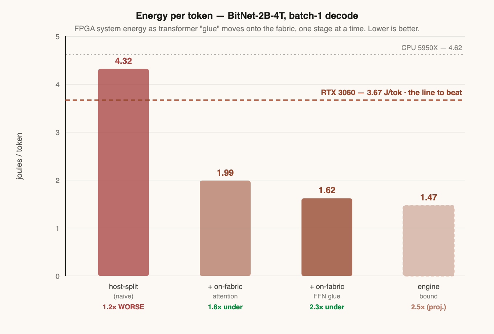
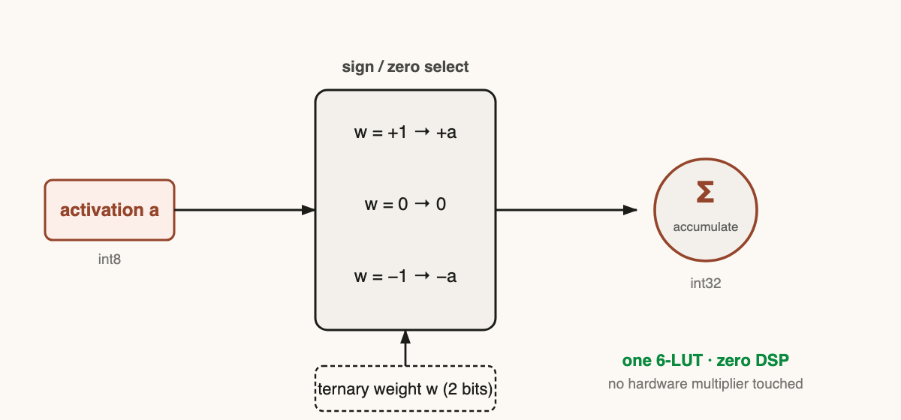
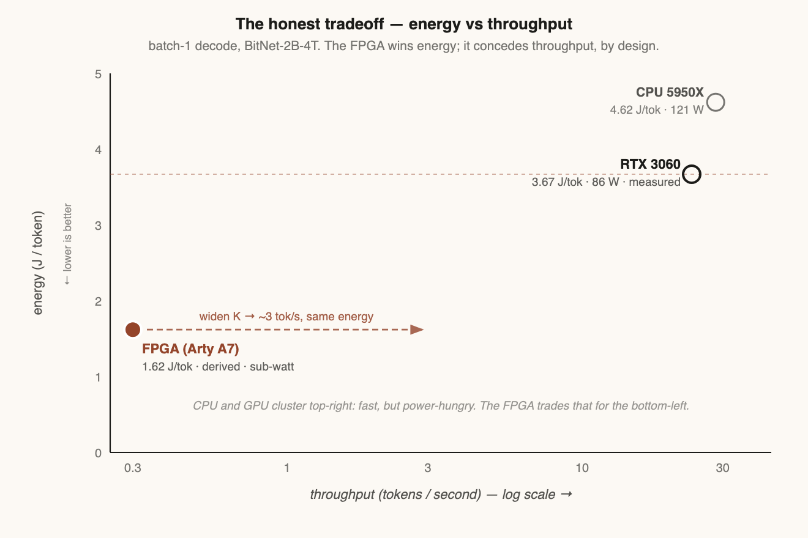
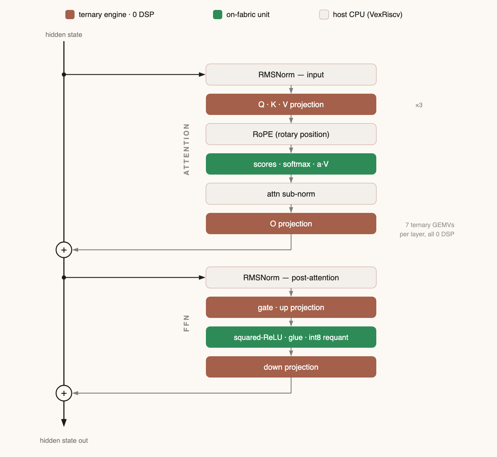
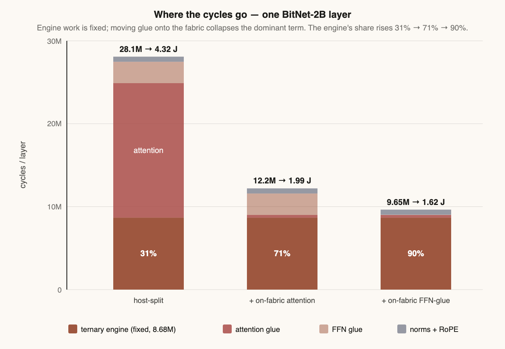
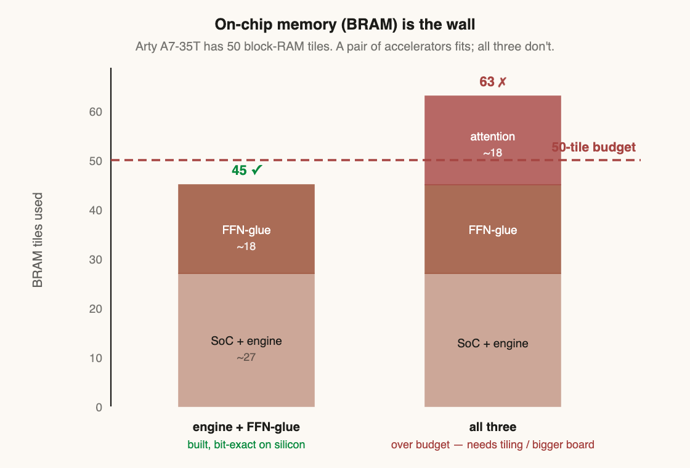

# ternfpga

**A multiplier-free, sparsity-skipping ternary LLM-inference engine on a \$130 FPGA — built to beat a GPU on the axis that actually matters at the edge: energy-per-token.**

<p align="center">
  
</p>
<p align="center"><sub><i>System energy/token (BitNet-2B-4T, batch-1 decode) as each piece of transformer "glue" moves onto the fabric. The naive design loses to the GPU; each on-fabric move drops it below the 3.67 J/tok line. The first three FPGA bars are derived from silicon-measured cycle counts; the rightmost is a projection.</i></sub></p>

> 📖 **Full deep-dive writeup:** [*Multiply-Free: A Ternary LLM Engine on a \$130 FPGA*](https://nicholi.ai/2026/06/09/multiply-free-a-ternary-llm-engine-on-a-130-fpga.html) — the theory, the nine-phase silicon build, the bugs, and an honest evidence ledger.

## The idea: stop moving bytes

Batch-1 LLM *decode* is **memory-bandwidth-bound** — every token streams the whole weight matrix from memory once, at ~1–2 FLOP/byte, so a GPU's tensor cores sit idle and *moving bytes* is the cost. Two compounding escapes cut the bytes, and a GPU can do **neither** in silicon:

- **Ternary weights** (BitNet b1.58, `w ∈ {−1, 0, +1}` ≈ 1.58 bit): the multiply becomes a **sign-select** — a single 6-LUT, **zero DSP multipliers**. A GPU has no ternary datapath, so it dequantizes back to INT8/FP16 and pays the full memory traffic and the full multiplier energy.
- **Activation sparsity**: BitNet's squared-ReLU FFN is **~60% zero per token** (measured); those weight columns never need fetching. GPUs accelerate only rigid **2:4** structured sparsity, not the per-token *unstructured* kind.

Nobody had combined **ternary × per-token unstructured sparsity on a sub-\$150 board** — that intersection is this project.

<p align="center">
  
</p>
<p align="center"><sub><i>The entire "multiply" in a ternary network: <code>acc += (w=+1 ? a : w=−1 ? −a : 0)</code> — a sign-and-zero select, one 6-LUT, no hardware multiplier touched. Confirmed <b>0 DSP</b> in synthesis up to datapath width 2048.</i></sub></p>

## The result, measured honestly

Head-to-head on the same machine (BitNet-2B-4T, batch-1, 256 tokens):

| platform | path | tok/s | power | J / token |
|---|---|---:|---:|---:|
| CPU 5950X | native ternary (`i2_s`) | 28.4 | ~121 W | 4.62 |
| **RTX 3060** | **bf16 (dequantized)** | 23.5 | 86.4 W | **3.67** |
| **FPGA Arty A7-35T** | **ternary, 0 DSP** | *slow, by design* | **~0.5 W** | **~1.62** *(derived)* |

The 3060 has no ternary datapath, so it inflates BitNet to bf16 (4.87 GB) and lands at **3.67 J/token — barely better than the CPU, and slower**. The FPGA keeps the ternary structure and does the same decode at an estimated **~1.62 J/token, ~2.3× less energy**, sub-watt. It **loses on raw throughput, by design** — the win is energy-per-token and a capability the GPU lacks.

<p align="center">
  
</p>
<p align="center"><sub><i>The honest tradeoff. CPU and GPU cluster top-right (fast, power-hungry); the FPGA sits bottom-left (low energy, low throughput). Energy/token is ~invariant to engine width, so widening the datapath buys throughput at constant energy.</i></sub></p>

**Evidence tiers** — every number labeled by how it was obtained:

- **Silicon-measured** — engine **1.00 cycle/tile** (0 DSP, bit-exact), DDR3 read roofline **1.42 GB/s**, host glue **19.4M cyc/layer**, on-fabric attention **16,456 cyc/query**, on-fabric FFN glue **13,974 cyc/layer**, engine + FFN-glue **co-resident & cooperating** on one 35T (**45/50 BRAM**, bit-exact end-to-end).
- **Derived** — system **~1.62 J/token** (~2.3× under the 3060), composed from measured cycle counts × the Vivado-estimated 0.489 W.
- **Projected** — **~1.47 J/token** engine bound (RMSNorm also on-fabric, ~2.5×); the full three-accelerator loop in one bitstream; a metered (vs estimated) watt.

> ⚠️ Power is the one un-metered input: every joule/token is *measured cycle counts × an estimated wattage*. A current-probe reading is the top open item.

## Architecture

One multiply-free **ternary engine** runs the seven GEMVs per layer (Q/K/V/O + gate/up/down); attention and the FFN glue became dedicated **on-fabric units**; only the RMSNorms and RoPE stay on a soft **VexRiscv** host — all on a single LiteX SoC with DDR3.

<p align="center">
  
</p>
<p align="center"><sub><i>One BitNet decoder layer, each operation tinted by where it runs: ternary engine (terracotta) / on-fabric unit (green) / host CPU (grey). The terracotta and green are silicon; only the thin grey blocks — the norms and RoPE — remain on the host.</i></sub></p>

## The build: nine phases, on real silicon

Test-driven throughout — a NumPy golden and a bit-exact cocotb test land **before** every module, and each piece is carried **PyTorch → simulation → silicon**.

| Phase | What landed | Result |
|---|---|---|
| 0 | Multiply-free ternary PE → flashed to the Arty | bit-exact over UART, **105 LUT, 0 DSP, ~63 mW** |
| — | CPU + GPU energy baselines | GPU **3.67** J/tok barely beats CPU **4.62** |
| 1 | DDR3 + RISC-V SoC (LiteX / VexRiscv / LiteDRAM) | engine as a peripheral, `GEMV_ONBOARD_PASS` |
| 2 | Research re-scope → BRAM-centric scalable engine + FFN datapath + sparse gather | cosine 1.0 vs PyTorch; 0 DSP to width 2048; 60% sparsity measured |
| 3 | DDR3 roofline (Risk 1) + full-layer golden + sparsity structure (Risk 2) | 1.42 GB/s; cosine 1.0; sparsity 94% data-dependent (unstructured) |
| 4 | Fully-measured host-split glue | **glue-bound: 4.32 J/tok, 1.2× _worse_** — the honest pivot |
| 5–6 | On-fabric attention (`rtl/attention_unit.sv`) → silicon | flips to **1.99 J/tok (~1.8× under)**, 16,456 cyc/query measured |
| 7–8 | On-fabric FFN glue (`rtl/ffn_glue_unit.sv`) → silicon | **1.62 J/tok (~2.3× under)**, 13,974 cyc/layer (184×) measured |
| 9 | Engine + FFN-glue **co-resident & cooperating** | bit-exact end-to-end, **45/50 BRAM** — the frontier |

<p align="center">
  
</p>
<p align="center"><sub><i>The same arc counted in cycles: the engine base is fixed; moving glue onto the fabric collapses the dominant term (the red attention block) until the engine is 90% of the layer.</i></sub></p>

## The honest frontier

Each accelerator is silicon-proven, and a **pair** (engine + full-width FFN-glue + the SoC) fits a 35T at **45/50 BRAM**. Adding the attention unit (~18 BRAM) needs 63 — so the **full three-accelerator decode loop in one bitstream** wants FFN-tiling or a bigger board (Arty A7-100T ~\$250 / KV260). The energy result is cycle-count-based and holds regardless of which board runs the integrated loop.

<p align="center">
  
</p>

## Layout
```
rtl/      hand-written SystemVerilog (ternary engine, attention, FFN-glue, DDR3 stream)
sim/      cocotb + verilator testbenches (TDD: tests land before RTL)
soc/      LiteX SoC builders + RISC-V firmware (engine / attention / ffn-glue / co-resident)
models/   ternary quantization + bit-exact NumPy & PyTorch references
bench/    benchmark harness, measured results, figures (FPGA vs RTX 3060)
syn/      Vivado OOC synthesis + P&R fit sweep + power
docs/     architecture, research, figures
```

## Reproduce
```bash
pip install -r requirements.txt     # + a system Verilator 5.020 install
bash tools/repro.sh                 # RTL sim suite (every DUT bit-exact, 0 DSP) + encoding test + figures
bash tools/repro.sh --full          # also validate the FFN golden vs PyTorch (needs torch + the model)
```
FPGA synthesis (`syn/run_synth.sh`, `syn/fit_sweep.sh`) and the on-board SoC builds + firmware (`soc/`, `soc/README.md`) are separate flows.

## Hardware / toolchain
Arty A7-35T (`xc7a35t`) · Vivado 2025.2 + Verilator + cocotb + openFPGALoader · RTX 3060 12 GB as the benchmark baseline. Full dated narrative in [`BUILDLOG.md`](BUILDLOG.md); architecture in [`docs/ARCHITECTURE.md`](docs/ARCHITECTURE.md).

## Status
✅ **The nine-phase silicon arc is complete.** The multiply-free engine, on-fabric attention, and on-fabric FFN-glue are each bit-exact on a physical Arty A7-35T; a pair co-resides and cooperates on one board; the system reaches an estimated **~1.62 J/token, ~2.3× under the RTX 3060**. _Open:_ RMSNorm on-fabric (→ ~1.47 J/tok / 2.5×), the full three-accelerator loop (tiling or a bigger board), a metered watt, and independent reproduction.

## License
[Apache-2.0](LICENSE).
