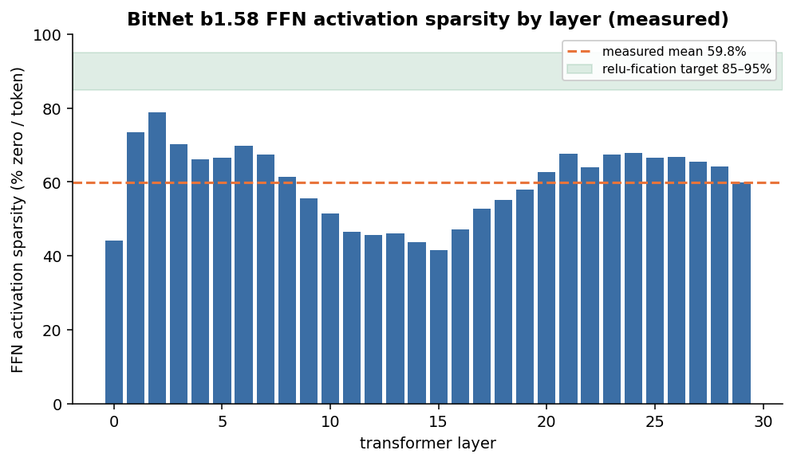
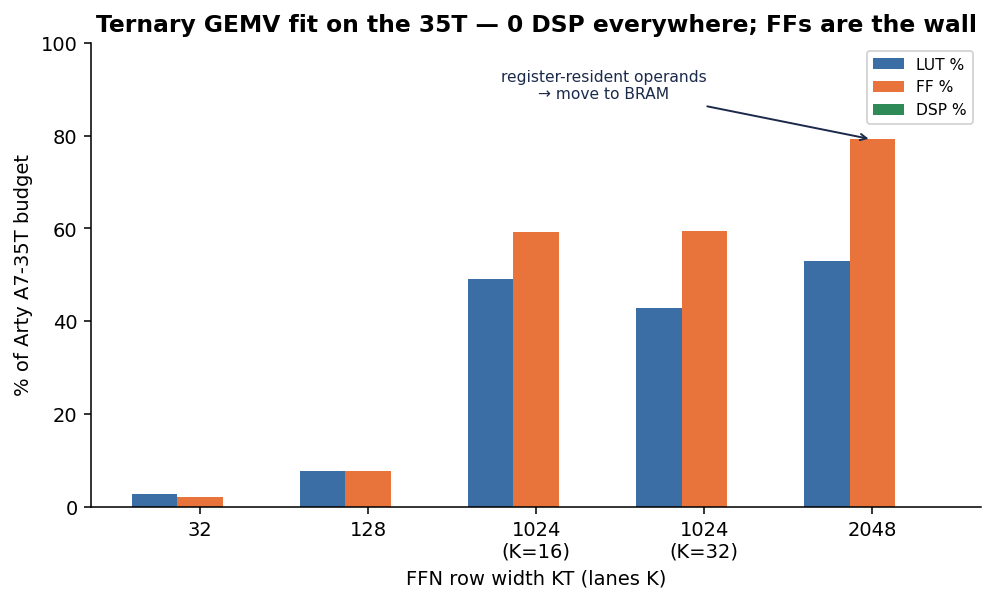
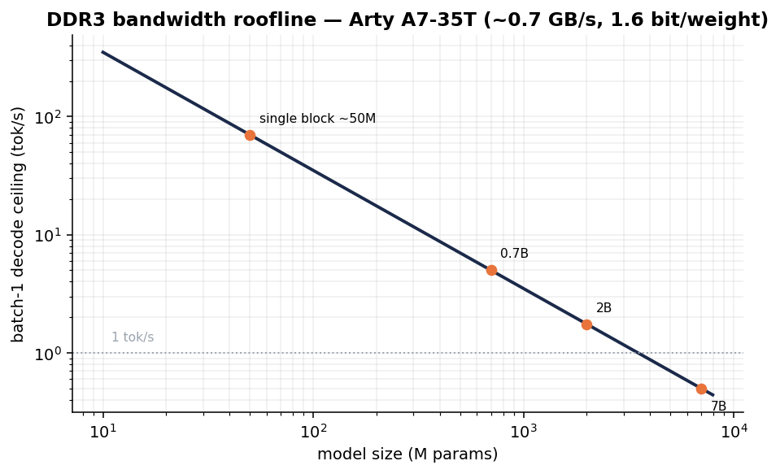

# Figures

Rendered from the measured results by [`make_plots.py`](make_plots.py):
`python bench/plots/make_plots.py` (needs `matplotlib`). Each figure cites its data source.

## Energy per token — the headline

CPU 5950X **4.62** J/tok (native ternary) · RTX 3060 **3.67** J/tok (bf16, dequantized — and *slower*) · FPGA A7-35T target **0.25–0.40**. The GPU has no ternary datapath, so it pays for precision it then throws away — exactly the gap the FPGA exploits. Data: [`gpu_baseline.md`](../results/gpu_baseline.md).

## BitNet b1.58 FFN activation sparsity (measured)

**59.8%** mean per-token sparsity (range 42–79% by depth) — real and GPU-unmatchable, but below the assumed 85–95% (the green band); relu-fication is the path there. Data: [`activation_sparsity.md`](../results/activation_sparsity.md).

## Ternary GEMV fit on the Arty A7-35T

**0 DSP at every width** to 2048; flip-flops (register-resident operands) are the wall at 79% → move operands to BRAM. Data: [`fit_sweep.md`](../results/fit_sweep.md).

## DDR3 bandwidth roofline

Batch-1 decode is bandwidth-bound: tok/s ceiling ≈ bandwidth ÷ bytes-per-token. At ~0.7 GB/s a single block runs at tens of tok/s; a 7B model won't clear 1 tok/s (or even fit 256 MB). Source: [`scaling-feasibility.md`](../../docs/research/scaling-feasibility.md) §2.
